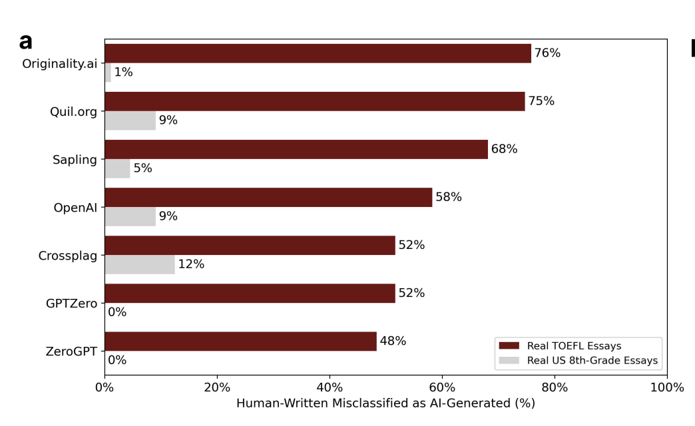

```{r setup, include=FALSE}
knitr::opts_chunk$set(echo = TRUE, warning = FALSE, message = FALSE)
```

# Using Simpler Models to Curb Bias in the Detection of LLM-Generated Essays

Generative Artificial Intelligence, especially those powered by Large Language Models, have captured the global imagination. They have proven useful at a large variety and volume of tasks. However, concerns over its impact on education, specifically in its use in generating essays on behalf of students, have arisen. Several competitions have been hosted to address this need (Kaggle). Hence, several researchers and companies have developed models to address the need of detecting LLM-generated text, specifically essays.

To solve this problem, researchers have tried a variety of approaches. Trained detectors like those used by ZeroGPT, GPTZero, Originality, Quill, etc. have obtained some level of traction in the market today. However, they are shown to be systematically biased against non-native English speakers (Zou et al). In an experiment carried out with real US 8th Grader essays and real TOEFL essays written by non-native English speakers, it was shown that the TOEFL essays were significantly more likely to be flagged as LLM-written by popular trained detectors. Furthermore, it is shown that by prompting Chat-GPT to “elevate the text with literary language”, the detection rate of these TOEFL essays is reduced, which is a damning indictment of modern GPT-detectors.

Recent advances in the field like DetectGPT (Mitchell et al) use probability curvature for zero-shot detection of machine-generated text and achieve a great level of accuracy in specific fields. However, this method is far more computationally expensive than trained detectors, and hence impractical to scale. Simple models in the past have shown good accuracy in predicting whether text is human or AI generated (Frohlig and Zubiaga), but one of their key assumptions is a lack of syntactic and linguistic diversity, a feature of non-native English writing, as demonstrated in Zou et al.

Hence, the question arises of whether lightweight and simple models can detect the use of LLMs in the generation of essays.

This research question will be answered in my final project. My data sources will be both the datasets used in ‘GPT detectors are biased against non-native English writers’ (Zou et al) and the dataset published in the ‘LLM - Detect AI Generated Text’ (Kaggle) competition. The first dataset (available here https://huggingface.co/datasets/WxWx/ChatGPT-Detector-Bias) consists of 91 real TOEFL essays written by non-native English speakers, as well as their counterparts after prompt engineering with the ‘literary language prompt’. The dataset also contains 88 US 8th Grade essays and 70 college essays written by native English speakers. The second dataset (available here https://www.kaggle.com/competitions/llm-detect-ai-generated-text/data?select=train_essays.csv) consists of 1378 essays. Though their origin is unknown, it is reasonable to assume that this dataset consists mainly of essays written by native English speakers. The two datasets will be appended and split into train, validation, and test datasets which I will use to train my models.

The data are labeled as Human and AI generated, and the prompts attached to them are also available. Model architectures both with and without the prompt will be tried to see which will yield greater accuracy. The only explanatory variable is the text, but it will be split into several variables using tokenization, stemming/lemmatization, and other natural language processing techniques. The outcome variable is a classification between human and AI generated. Some models will also output a probability associated with the likelihood of being human or AI generated. Hence, it is a supervised learning task.


## Loading the Data

```{r loady}

# Load the data
library(tidyverse)
library(here)
library(tidyjson)

biased_detectors_path <- here("biased_detectors_data", "all_data.json")

biased_detectors_df <- read_json(biased_detectors_path) %>%
  gather_array() %>%
  spread_all() %>%
  as_tibble()

kaggle_df <- read_csv(here("kaggle_data", "train_v2.csv"))

```


## Exploration of the Data

Once the data is loaded, we explore the data to try and understand it and how it was generated. Since we are choosing to use small models with text data, we need to understand the nature of the data and the kind of essays we are dealing with, rather than just throwing it into a large neural network.

### Biased Detectors Data

```{r}

biased_detectors_df %>%
  group_by(kind) %>%
  summarise(n = n()) %>%
  ggplot() +
  geom_col(aes(kind, n)) +
  labs(title = "Number of Essays by Kind In the Biased Detectors Dataset",
       x = "Kind",
       y = "Number of Essays")


```

We see that there are many more AI-Generated essays than human-written essays in the biased detectors dataset.
However this is because some of the AI-Generated essays are simply human-written essays "polished" by AI, and are not AI-Generated from scratch.

```{r}

biased_detectors_df %>%
  group_by(domain, kind) %>%
  summarise(n = n()) %>%
  ggplot() +
  geom_col(aes(domain, n, fill = kind)) +
  labs(title = "Number of Essays by Domain In the Biased Detectors Dataset",
       x = "Domain",
       y = "Number of Essays") +
  coord_flip()


```

Here, we see the split of essays by kind and domain in the biased detectors dataset.

TOEFL_real_91 corresponds to the TOEFL essays written by non-native English speakers. A sample is visible below:

```{r}

text_toefl_sample <- biased_detectors_df %>%
  filter(domain == "TOEFL_real_91") %>%
  select(text) %>%
  head(n=1L)

text_toefl_sample$text[1]

```
These essays were written by non-native english speakers and tended to be classified as GPT-Written. A prompt was supplied to GPT to enhance the linguistic complexity of these essays yielding the class TOEFL_gpt4polished_91. A sample is visible below:

```{r}

text_toefl_sample <- biased_detectors_df %>%
  filter(domain == "TOEFL_gpt4polished_91") %>%
  select(text) %>%
  head(n=1L)

text_toefl_sample$text[1]

```

As we can see above, the sentence structure and language used is far more complex, and this was enough to fool GPT-Detectors like GPTZero, ZeroGPT, and more.

CS224n_real_145 corresponds to the titles and abstracts of papers in the CS224n course at Stanford University. A sample is visible below:

```{r}

text_cs_sample <- biased_detectors_df %>%
  filter(domain == "CS224N_real_145") %>%
  select(text) %>%
  head(n=1L)

text_cs_sample$text[1]

```

These pieces of text seem to be less essays and more technical papers, which may tend to confuse our model, especially since we intend to use smaller, more efficient models. Hence, I am choosing to omit these titles and abstracts from my analysis.

CollegeEssay_real_70 corresponds to Common Application college essays written by American students. A sample is visible below:

```{r}

text_ce_sample <- biased_detectors_df %>%
  filter(domain == "CollegeEssay_real_70") %>%
  select(text) %>%
  head(n=6L)

text_ce_sample$text[3]

```

These essays are written by American students and are the most likely to be classified as human-written.
The authors of the paper also created 31 GPT-written essays with the same Common App prompts to yield the class CollegeEssay_gpt3_31. A sample is visible below:

```{r}

text_ce_sample <- biased_detectors_df %>%
  filter(domain == "CollegeEssay_gpt3_31") %>%
  select(text) %>%
  head(n=6L)

text_ce_sample$text[3]

```

These essays were written by GPT-3.5 and are the most likely to be classified as AI-Generated. To counter this, the authors employed a self-edit prompt, asking the model to "elevate the essays with literary language" which was enough to fool detectors.

Here is the same sample but elevated:

```{r}

text_ce_sample <- biased_detectors_df %>%
  filter(domain == "CollegeEssay_gpt3PromptEng_31") %>%
  select(text) %>%
  head(n=6L)

text_ce_sample$text[3]

```


We can quickly plot the effect of the "Elevation" prompt using the following wordclouds:

The blue wordcloud represents college essays generated by GPT while the red one represents the same essays after the "elevation" prompt was used.


```{r, warning=FALSE, message=FALSE}

library(wordcloud)

ce_gpt3 <- biased_detectors_df %>%
  filter(domain == "CollegeEssay_gpt3_31") %>%
  select(text) %>%
  pull()

ce_gpt3_elevated <- biased_detectors_df %>%
  filter(domain == "CollegeEssay_gpt3PromptEng_31") %>%
  select(text) %>%
  pull()
par(mfrow=c(1, 2))
wordcloud(ce_gpt3, max.words = 50, colors = c("BLUE3"))
wordcloud(ce_gpt3_elevated, max.words = 50, colors = c("RED3"))

```

### Kaggle Data

The Kaggle Data is far simpler. It simply consists of essays written by students for 3 different prompts. The essays are labelled as either "0" for student-written and "1" for AI-written.


```{r}

kaggle_df %>%
  group_by(label) %>%
  summarise(n = n()) %>%
  ggplot() +
  geom_col(aes(label, n)) +
  labs(title = "Number of Essays by Type In the Kaggle Dataset",
       x = "Label (0 = Human, 1 = AI)",
       y = "Number of Essays")

library(tidytext)

```

## Preparing the data for learning


```{r}

library(SnowballC)

bias_ml_df <- biased_detectors_df %>%
  filter(domain != "CS224N_gpt3_145" & domain != "CS224N_real_145" & domain != "CS224N_gpt3PromptEng_145") %>%
  mutate(label = factor(if_else(model == "Human", 0, 1))) %>%
  mutate(document_number = 50000 + array.index) %>%
  select(document_number, text, label)

kaggle_ml_df <- kaggle_df %>%
  mutate(label = factor(label)) %>%
  select(text, label) %>%
  rowid_to_column(var = "document_number")

composite_ml_df <- bind_rows(bias_ml_df, kaggle_ml_df) %>%
  arrange(document_number)

composite_dtm <- composite_ml_df %>%
  unnest_tokens(output = "tokens", input = "text") %>%
  mutate(stemmed_tokens = wordStem(tokens)) %>%
  group_by(document_number, label, stemmed_tokens) %>%
  count() %>%
  cast_dtm(document = "document_number", term = "stemmed_tokens", value = "n", weighting = tm::weightTfIdf)

composite_dtm

```
### How many essays are in the composite dataset and of which types

```{r}

composite_ml_df %>%
  group_by(label) %>%
  summarise(n = n()) %>%
  ggplot() +
  geom_col(aes(label, n)) +
  labs(title = "Number of Essays by Type In the Composite Dataset",
       x = "Label (0 = Human, 1 = AI)",
       y = "Number of Essays")

```

### Inspecting the DTM

Here are some terms that occur more than 100 times

```{r}

library(tm)
findFreqTerms(composite_dtm, 100)

```
We can also find words strongly associated with "drive" for example, since "phones and driving" is one of the essay topics

```{r}

findAssocs(composite_dtm, "drive", 0.5)

```
We see that "accid", the stemmed version of "accident", "driver", "road", and "while" are strongly associated with "drive"

Next, let's see what happens if we remove very sparse terms from the DTM.


```{r}

# Remove terms that appear in less than 10% of documents
inspect(removeSparseTerms(composite_dtm, 0.1))

```

## Exploratory Machine Learning

I'm choosing to call this step "Exploratory Machine Learning" because I'm not entirely sure how each model will perform. Hence, I'm not using the usual `tidymodels` workflow but rather the underlying engines directly to test some "quick and dirty" models and get an indication of what the right model architecture for the final model might be. I'm starting with the most basic nearest centroid classifier, and then trying to perform PCA to see if we can reduce the dimensionality of this data, followed by logistic regression.

### Training a Basic NM model (Nearest Centroid Classifier)

The first model I'm training is a Nearest Centroid Classifier. This is a simple model that calculates the centroid of each class and then classifies new data based on the nearest centroid. It is a simple model that is easy to understand and interpret, and hence it should be a good starting point as I embark on my journey to understand the data and the best model for it.

```{r}

## create training and testing split
X_tfidf <- as.matrix(removeSparseTerms(composite_dtm, 0.8))

train_index = sample(1:nrow(X_tfidf) , size = 0.8 * nrow(X_tfidf))
test_index = (1:nrow(X_tfidf))[-train_index]

X_train <- X_tfidf[train_index,]
X_test <- X_tfidf[test_index,]

# Train a model
library(klaR)

tfidf_classifier <- nm(x=X_train, grouping=composite_ml_df[train_index,]$label)

tfidf_tr_pred <- predict(tfidf_classifier, newdata = X_train)$class
tfidf_tst_pred <- predict(tfidf_classifier, newdata = X_test)$class

paste0('tf-idf based Nearest Centroid classifier training accuracy: ', mean(composite_ml_df[train_index,]$label == tfidf_tr_pred))

paste0('tf-idf based Nearest Centroid classifier test accuracy: ', mean(composite_ml_df[test_index,]$label == tfidf_tst_pred))

```

It looks like the Nearest Centroid Classifier is not performing very well. This is likely because the data is very sparse and high-dimensional, and hence the centroids are not very meaningful. It does achieve 0.822 test accuracy, which is not a terrible start.

Ideally, the best metric for a classification would be AUROC but we cannot draw ROC curves for Nearest Centroid Classifiers. Hence, we will use accuracy as a metric for this model.

### Training a logistic regression model

```{r}

library(glmnet)

# Train a model

tfidf_classifier <- cv.glmnet(x=X_train, y=composite_ml_df[train_index,]$label, family = "binomial", alpha = 1)

tfidf_tr_pred <- predict(tfidf_classifier, newx = X_train, s = "lambda.min", type = "class")
tfidf_tst_pred <- predict(tfidf_classifier, newx = X_test, s = "lambda.min", type = "class")

paste0('tf-idf based logistic regression training accuracy: ', mean(composite_ml_df[train_index,]$label == tfidf_tr_pred))

paste0('tf-idf based logistic regression test accuracy: ', mean(composite_ml_df[test_index,]$label == tfidf_tst_pred))

tfidf_tr_prob <- predict(tfidf_classifier, newx = X_train, s = "lambda.min", type = "response")
tfidf_tst_prob <- predict(tfidf_classifier, newx = X_test, s = "lambda.min", type = "response")

library(ModelMetrics)

paste0('tf-idf based logistic regression training AUROC: ', auc(composite_ml_df[train_index,]$label, tfidf_tr_prob))

paste0('tf-idf based logistic regression test AUROC: ', auc(composite_ml_df[test_index,]$label, tfidf_tst_prob))

```
The logistic regression model performs better than the Nearest Centroid Classifier, achieving 0.933 test accuracy. The AUROC is also 0.97, which is a good sign. Is this because the predicted probabilties are always near 0 and 1?

```{r}

tfidf_tr_prob %>%
  data.frame() %>%
  ggplot() +
  geom_histogram(aes(x = lambda.min, y = ..density..), bins = 50) +
  labs(title = "Distribution of Predicted Probabilities for Training Data",
       x = "Predicted Probability",
       y = "Density")

```


It looks like we have a good spread of predicted probabilities, which means the model is quite certain about which essays are AI and Human-Written.

What are the most important terms according to the logistic regression model?

```{r}

library(vip)

vip(tfidf_classifier, num_features = 10)

```

It looks like "and", "the", "to", "i" etc. are the most important words. On the surface it might seem like this is a bad thing, but actually since our aim is to classify essays as AI or Human-Written, these "stop words" are likely to be very important. It is imperative that our model doesn't use information from words that are highly unlikely to appear in essays depending on the topic. Hence, we can see that the important words are topic-agnostic which bodes well for our hopes of creating a robust detector

### Running Principal Component Analysis

```{r}

library(irlba)

system.time(
      X_pca <- prcomp_irlba(X_tfidf, n = 50))

X_pca_train <- X_pca$x[train_index,]
X_pca_test <- X_pca$x[test_index,]

# How much is explained by the principal components?

summary(X_pca)


```

How much of the variance is explained by the first 10 PCs?

```{r}

screeplot(X_pca, main = "Screeplot of the first 10 PCs")


```

It doesn't look like our Principal Component Analysis has yielded Components that explain a lot of the variance. This is likely because the data is very sparse and high-dimensional, and hence each of the stemmed terms' vectors are likely to be orthogonal to each other.


### Logistic Regression with Principal Components

```{r}

# Train a model

pca_classifier <- cv.glmnet(x=X_pca_train, y=composite_ml_df[train_index,]$label, family = "binomial", alpha = 1)

pca_tr_pred <- predict(pca_classifier, newx = X_pca_train, s = "lambda.min", type = "class")
pca_tst_pred <- predict(pca_classifier, newx = X_pca_test, s = "lambda.min", type = "class")

paste0('PCA based logistic regression training accuracy: ', mean(composite_ml_df[train_index,]$label == pca_tr_pred))

paste0('PCA based logistic regression test accuracy: ', mean(composite_ml_df[test_index,]$label == pca_tst_pred))

pca_tr_prob <- predict(pca_classifier, newx = X_pca_train, s = "lambda.min", type = "response")
pca_tst_prob <- predict(pca_classifier, newx = X_pca_test, s = "lambda.min", type = "response")

library(ModelMetrics)

paste0('PCA based logistic regression training AUROC: ', auc(composite_ml_df[train_index,]$label, pca_tr_prob))

paste0('PCA based logistic regression test AUROC: ', auc(composite_ml_df[test_index,]$label, pca_tst_prob))


```
It looks like the PCA based logistic regression model is not performing as well as the tf-idf based logistic regression model. This is likely because the Principal Components do not explain a lot of the variance in the data, and hence the model is not able to capture the most important features of the data.

Hence, we move ahead with the tf-idf document-term matrix as our final data, and we proceed to tidymodels and try other algorithms, with a hunch that logistic regression may perform the best.

### Trying multiple models

```{r}

library(tidymodels)

combined_df <- as_tibble(X_tfidf) %>%
  mutate(label = composite_ml_df$label)

train_df <- as_tibble(X_train) %>%
  mutate(label = composite_ml_df[train_index,]$label)

test_df <- as_tibble(X_test) %>%
  mutate(label = composite_ml_df[test_index,]$label)

# Create a 5-fold cross-validation object
cv_folds <- vfold_cv(train_df, v = 5, repeats = 1)

data_recipe = recipe(label ~ ., data = combined_df) |> 
  step_scale(all_predictors()) |> 
  step_center(all_predictors())

model_svm_p = svm_poly(degree = 2, cost = 1) |>
  set_engine("kernlab") |>
  set_mode("classification")

model_rf50 = rand_forest(trees = 50) |> 
  set_engine("ranger") |>
  set_mode("classification")

model_logistic_reg = logistic_reg(penalty = 0, mixture = 0) |>
  set_engine("glmnet") |>
  set_mode("classification")

wf_set <- workflow_set(
  preproc = list(data_recipe),
  models = list(
    #svm_poly = model_svm_p,
    random_forest = model_rf50,
    logistic_reg = model_logistic_reg)
  )

# Fit all the workflows
wf_set_fitted <- workflow_map(wf_set, "fit_resamples", resamples = cv_folds)


# Collect metrics
results <- wf_set_fitted %>%
  collect_metrics(summary = TRUE)

results

parsnip::autoplot(
  wf_set_fitted,
  rank_metric = "accuracy",  # <- how to order models
  metric = c("roc_auc","accuracy") 
  ) +
  theme(legend.position = "none") +
    ggrepel::geom_text_repel(aes(y = mean +1.95*std_err, label = model),hjust=0,vjust=1) 


```
In the plot above, we do not see the SVM model, because it takes a very long time to train. Here is the image with the SVM model.


From the plot above, we see that the best performing model is Random Forest, since the metric I value the most is AUROC.

## Final Modeling

We will now use Random Forest with a tuned number of features to train our final model.

```{r}


best_model_index <- results |>
  filter(.metric == "roc_auc") |>
  arrange(desc(mean)) |>
  slice(1) |> # pick the first row
  pull(wflow_id)

# extract the best model
best_workflow <- wf_set_fitted |>
  extract_workflow(id = best_model_index)

# 2. Refit the best model on the full training data
wf_best_fit <- best_workflow |>
  fit(data = train_df)


```


## Testing the Final Model

### On the Test Set

```{r}

test_predictions <- wf_best_fit %>%
  predict(new_data = test_df) %>%
  bind_cols(test_df)

test_predictions %>%
  metrics(truth = label, estimate = .pred_class)

```

It achieves an Accuracy of 97% on the test set, which is remarkable. However, the true test is how it performs on the biased detectors dataset, which is the dataset we are most interested in.

We will also compare our logistic regression model's performance on the biased detectors dataset.

### Testing the Random Forest Model on Only the Biased Detectors Data

```{r}

X_tfidf_bias <- X_tfidf[44869:45182,]
labels_bias <- composite_ml_df[44869:45182,]$label

tfidf_bias_pred <- predict(wf_best_fit, new_data = X_tfidf_bias) %>%
  bind_cols(as_tibble(labels_bias))

paste0('tf-idf based random forest bias dataset accuracy: ', mean(labels_bias == tfidf_bias_pred$.pred_class))

tfidf_bias_pred <- as.factor(tfidf_bias_pred$.pred_class)

library(caret)

confusionMatrix(data = tfidf_bias_pred, reference = labels_bias)

bias_df_domain <- biased_detectors_df %>%
  filter(domain != "CS224N_gpt3_145" & domain != "CS224N_real_145" & domain != "CS224N_gpt3PromptEng_145") %>%
  mutate(label = factor(if_else(model == "Human", 0, 1))) %>%
  mutate(document_number = 50000 + array.index)

bias_df_domain$pred <- tfidf_bias_pred

bias_df_domain %>%
  mutate(pred_no = as.numeric(pred) - 1) %>%
  group_by(domain, kind) %>%
  summarise(percent_labeled_as_AI= mean(pred_no)) %>%
  ggplot() +
  geom_col(aes(domain, percent_labeled_as_AI, fill = kind)) +
  labs(title = "Percent of Essays labeled as AI by Domain In the Biased Detectors Dataset",
       x = "Domain",
       y = "Percent labeled as AI") +
  coord_flip()


```


### Testing the Logistic Regression Model on Only the Biased Detectors Data

```{r}

X_tfidf_bias <- X_tfidf[44869:45182,]
labels_bias <- composite_ml_df[44869:45182,]$label

tfidf_bias_pred <- predict(tfidf_classifier, newx = X_tfidf_bias, s = "lambda.min", type = "class")

paste0('tf-idf based logistic regression bias dataset accuracy: ', mean(labels_bias == tfidf_bias_pred))

tfidf_bias_prob <- predict(tfidf_classifier, newx = X_tfidf_bias, s = "lambda.min", type = "response")

paste0('tf-idf based logistic regression biased dataset AUROC: ', auc(labels_bias, tfidf_bias_prob))


tfidf_bias_pred <- as.factor(tfidf_bias_pred)
confusionMatrix(data = tfidf_bias_pred, reference = labels_bias)

bias_df_domain <- biased_detectors_df %>%
  filter(domain != "CS224N_gpt3_145" & domain != "CS224N_real_145" & domain != "CS224N_gpt3PromptEng_145") %>%
  mutate(label = factor(if_else(model == "Human", 0, 1))) %>%
  mutate(document_number = 50000 + array.index)

bias_df_domain$pred <- tfidf_bias_pred

bias_df_domain %>%
  mutate(pred_no = as.numeric(pred) - 1) %>%
  group_by(domain, kind) %>%
  summarise(percent_labeled_as_AI= mean(pred_no)) %>%
  ggplot() +
  geom_col(aes(domain, percent_labeled_as_AI, fill = kind)) +
  labs(title = "Percent of Essays labeled as AI by Domain In the Biased Detectors Dataset",
       x = "Domain",
       y = "Percent labeled as AI") +
  coord_flip()

```

## Conclusion

As we see in the above plots, the Random forest performs significantly better than the Logistic regression model.
Additionally, it would seem that we have totally removed the problem of misclassification of Human-Generated TOEFL essays. Our Random Forest model performs better than the prevalent AI models seen in the plot below.




Additionally, the random forest model model is not easily fooled by rewriting with the "polishing" prompt. In fact, the polishing prompt makes our model label more of the essays as AI-generated, which is good because they are in fact AI generated. Hence, we conclude that simpler models can be used to reliably detect LLM-Generated Text in an unbiased manner.


